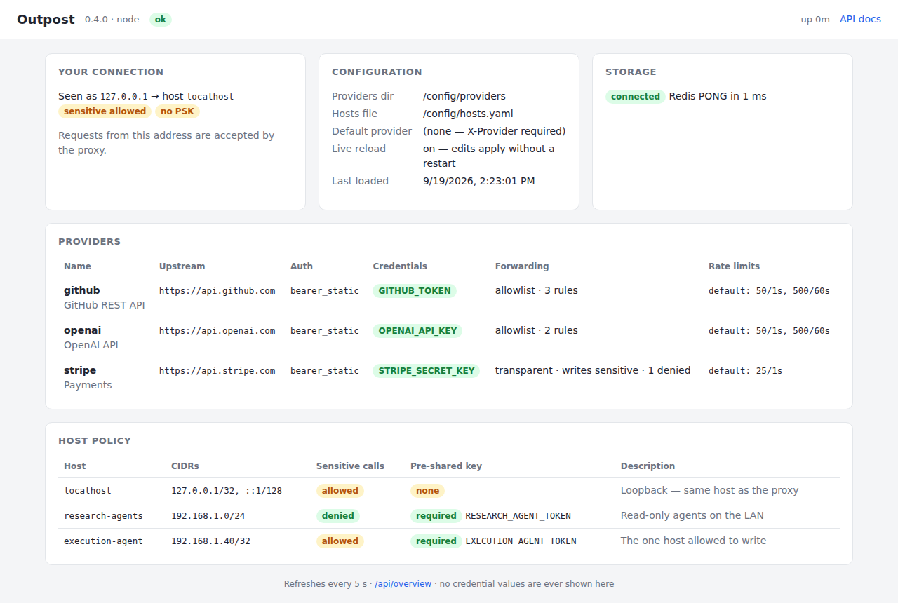

# Outpost on TrueNAS

Outpost is available in the **community train** of the TrueNAS Apps catalog. This
page covers what the app installs, how the installation form maps onto Outpost's
configuration, how to add providers once it is running, and the dashboard that
shows you what it loaded.

The packaging follows the catalog's Traefik app one for one: a single config
dataset that is watched for changes, a dashboard on the same port as the
service, credentials as environment variables, and a read-only status page that
never shows a secret.

If you are not on TrueNAS, see the [README](../README.md) — everything here also
applies to any Docker host, the form fields are just environment variables and
bind mounts.

---

## What the app does

Outpost sits between your AI agents and the APIs they need to call. Agents send
their request to Outpost with an `X-Provider` header; Outpost attaches the
credential for that provider, enforces which paths and hosts are allowed,
rate-limits, caches, and forwards the call upstream.

The point is what does *not* happen: **the agent never sees the credential.** A
prompt-injected agent can only make the calls your provider YAML and host policy
permit, and it cannot exfiltrate a token it was never given.

The TrueNAS app deploys two containers:

| Container        | What it is                                                       |
| ---------------- | ---------------------------------------------------------------- |
| `outpost`        | The proxy itself (`ghcr.io/sausin/outpost-ts`, Node runtime)       |
| `outpost-redis`  | Sibling Valkey/Redis used for token storage, rate limits, caching |

A third short-lived container (`outpost-perms`) checks the permissions on the
config dataset before the app starts, and exits.

---

## Installation form → what it actually sets

### App Configuration

| Form field                           | Effect                                                                                              |
| ------------------------------------ | --------------------------------------------------------------------------------------------------- |
| **Timezone**                         | `TZ` in both containers. Only affects log timestamps.                                              |
| **Dashboard**                        | `OUTPOST_DASHBOARD`. On by default; the portal link opens `/dashboard`. Off removes `/dashboard`, `/api/overview` and the redirect from `/`, and the portal opens `/docs` instead. |
| **Redis Password**                   | Password for the sibling Redis. Outpost receives it as `REDIS_URL=redis://default:<password>@outpost-redis:6379`. |
| **Default Provider**                 | `OUTPOST_DEFAULT_PROVIDER`. Optional — when set, requests without an `X-Provider` header use it.      |
| **Additional Environment Variables** | Free-form `name`/`value` pairs. **This is where provider credentials go** (`GITHUB_TOKEN`, `STRIPE_SECRET_KEY`, …) and where you set the per-host PSKs referenced by `auth_token_env`. |

### User and Group

| Form field   | Effect                                                                       |
| ------------ | ---------------------------------------------------------------------------- |
| **User ID**  | `user:` in the generated compose. Defaults to `568` (the TrueNAS `apps` user). |
| **Group ID** | Same, for the group.                                                          |

Outpost runs correctly as any non-root uid:gid — it chowns nothing at startup
and writes nothing outside the config dataset and `/tmp`.

### Network

| Form field    | Effect                                                                         |
| ------------- | -------------------------------------------------------------------------------- |
| **Web Port**  | Published host port, and `OUTPOST_PORT` inside the container. Default `30461`. Agents call it; the portal opens the dashboard on it. |

Outpost binds `0.0.0.0` inside the container (`OUTPOST_BIND_ADDRESS`).

### Storage

| Form field            | Effect                                                                            |
| --------------------- | ----------------------------------------------------------------------------------- |
| **Outpost Config Storage** | Mounted at `/config`. Holds `hosts.yaml` and `providers/`. Defaults to an ixVolume dataset. |
| **Redis Data Storage**     | Mounted at `/data` in the Redis container.                                       |

Inside the container this maps to:

```
/config/hosts.yaml       ← OUTPOST_HOSTS_FILE
/config/providers/       ← OUTPOST_PROVIDERS_DIR
```

On first boot with an empty dataset, Outpost writes a commented starter
`hosts.yaml` (loopback only) and a disabled `providers/example.yaml` so there is
something to edit rather than an empty directory. Neither file is ever
overwritten afterwards.

**Edits apply live.** The app sets `OUTPOST_CONFIG_WATCH=true`, so both files
are re-read whenever they change on the dataset — the same behaviour as the
Traefik app's config directory. There is no restart step after adding a
provider or widening `hosts.yaml`. Changes to *environment variables* (a new
credential) still go through **Edit** on the app, which restarts it.

---

## Every environment variable

| Variable                 | Default              | Purpose                                                  |
| ------------------------ | -------------------- | -------------------------------------------------------- |
| `OUTPOST_PORT`           | `8080`               | Listen port                                              |
| `OUTPOST_BIND_ADDRESS`   | `0.0.0.0`            | Listen address                                           |
| `OUTPOST_PROVIDERS_DIR`  | `/config/providers`  | Directory scanned for `*.yaml` / `*.yml` provider defs   |
| `OUTPOST_HOSTS_FILE`     | `/config/hosts.yaml` | Host access policy                                       |
| `OUTPOST_PLUGINS_DIR`    | `/config/plugins`    | Directory custom auth modules (`type: plugin`) are imported from |
| `OUTPOST_DEFAULT_PROVIDER` | *(unset)*          | Provider used when the request carries no `X-Provider`   |
| `OUTPOST_SEED_CONFIG`    | *(unset)*            | Set to `false` to disable first-boot config seeding      |
| `OUTPOST_DASHBOARD`      | `true`               | Serve `/dashboard` and `/api/overview` (the app form's **Dashboard** toggle) |
| `OUTPOST_CONFIG_WATCH`   | `true`               | Re-read `providers/`, `hosts.yaml` and `plugins/` when they change on disk |
| `OUTPOST_VERSION`        | *(baked into the image)* | Release version shown on the dashboard and in `/openapi.json` |
| `REDIS_URL`              | `redis://localhost:6379/0` | Redis connection string                            |
| `OUTPOST_TRUSTED_PROXIES` | *(unset)*           | Set when a reverse proxy fronts Outpost — see below      |
| `OUTPOST_LOG_LEVEL`      | `info`               | Log verbosity                                            |
| *provider credentials*   | —                    | Plain env vars named by your provider YAMLs              |

The pre-0.4 names `PROXY_PORT`, `PROXY_HOST`, `PROVIDERS_DIR`,
`HOSTS_CONFIG_PATH` and `DEFAULT_PROVIDER` are still read as fallbacks, so
existing deployments keep working. When both are set, the `OUTPOST_*` name wins.

---

## Adding a provider

1. **Get to the dataset.** The config dataset is at
   `/mnt/<pool>/ix-apps/app_mounts/outpost/config` (or wherever you pointed the
   Storage field). Reach it over SMB/NFS if you have shared it, or from
   **System → Shell**.

2. **Drop in a YAML.** A provider can be three lines:

   ```yaml
   name: github
   base_url: https://api.github.com
   auth: { type: bearer_static, env: GITHUB_TOKEN }
   ```

   Save it as `providers/github.yaml`. Every `*.yaml` in that directory is
   loaded; `enabled: false` skips one without deleting it.

3. **Set the credential.** In the TrueNAS UI: **Edit** the app → **Additional
   Environment Variables** → add `GITHUB_TOKEN` with your token as the value.

4. **Check it took.** Open the dashboard (the portal link). The provider
   appears in the *Providers* table within a second or two of the file being
   saved; its credential shows as a green `GITHUB_TOKEN` badge once the variable
   is set. No restart is needed for the YAML — the environment variable in step
   3 is the only thing that restarts the app.

   A provider whose credential is missing shows up as *failed to load* with the
   reason, and the proxy keeps running with the rest. `GET /providers` gives the
   same list as JSON.

Point your agent at `http://<truenas-ip>:<port>` and set `X-Provider: github` on
its requests. The path is forwarded verbatim, so
`GET /repos/foo/bar` becomes `GET https://api.github.com/repos/foo/bar` with the
`Authorization` header filled in.

See the [README](../README.md) for the full provider schema: allowlist mode,
per-route caching, rate-limit windows, OAuth2, HMAC signing and the rest.

---

## Custom auth schemes

The ten built-in auth types cover most APIs: a static bearer token, an API key
in a header or query parameter, HTTP basic, HMAC request signing, OAuth2
client-credentials, a token kept in Redis, and `custom_headers` for anything
that is "put these fixed headers on every request". Start there; a plugin is
only needed when a credential has to be *computed* per request or *minted* from
another call — a TOTP code, an AWS SigV4 signature, a vendor's own token
exchange.

For those, the image imports a JavaScript module from the config dataset at
runtime. **No custom image and no rebuild.**

1. **Write the module** as plain ESM into `plugins/` on the config dataset,
   next to `providers/`. It exports a class with a static
   `fromConfig(config, deps)` that returns an object with `apply`,
   `invalidate` and `isRejection`. Nothing is imported from Outpost:

   ```js
   // /config/plugins/acme_signed.mjs
   import { createHmac } from "node:crypto";

   export class AcmeSignedAuth {
     constructor(secret, keyId) { this.secret = secret; this.keyId = keyId; }

     // config: the `config:` block of the provider YAML.
     // deps.env: environment variables; deps.tokenStorage: Redis-backed
     // get/set(key, value, ttlSeconds)/delete/pttl, for plugins that mint
     // and cache a token.
     static fromConfig(config, deps) {
       const secret = deps.env[config.secret_env];
       if (!secret) throw new Error(`${config.secret_env} is not set`);
       return new AcmeSignedAuth(secret, deps.env[config.key_id_env]);
     }

     // ctx: { method, fullPath, queryString, body, headers }.
     // Return `headers` to add; optionally `queryParams` to append.
     async apply(ctx) {
       const ts = Math.floor(Date.now() / 1000).toString();
       const sig = createHmac("sha256", this.secret)
         .update(`${ts}${ctx.method}${ctx.fullPath}`)
         .digest("hex");
       return { headers: { "X-Key-Id": this.keyId, "X-Timestamp": ts, "X-Signature": sig } };
     }

     // Called when isRejection() says the upstream refused the credential.
     async invalidate() {}
     isRejection(status) { return status === 401; }
   }
   ```

2. **Reference it** from the provider YAML. The file part is relative to
   `plugins/`; the part after the colon is the export name:

   ```yaml
   name: acme
   base_url: https://api.acme.example
   auth:
     type: plugin
     module_ts: acme_signed.mjs:AcmeSignedAuth
     config:
       secret_env: ACME_SECRET
       key_id_env: ACME_KEY_ID
   ```

3. **Set the credentials** as environment variables on the app, exactly as for
   a built-in auth type. The dashboard shows `ACME_SECRET` and `ACME_KEY_ID` as
   badges (it finds every `*_env` key in the block) and never shows their
   values.

Both files are picked up live. Editing the module and saving it re-imports it
on the next reload, so iterating on a plugin is save-and-retry, not
save-restart-retry. A module that fails to import, exports the wrong name, or
whose `fromConfig` throws, disables that one provider and puts the reason on
the dashboard under *failed to load*; the other providers keep running.

Rules the loader enforces: the path must stay inside `plugins/` (no `..`, no
absolute paths), and the file must end in `.js`, `.mjs`, `.cjs` or `.ts`
(`.ts` needs the type-stripping Node ships from 22.18 on, so `.mjs` is the safe
choice). A plugin is code running with the proxy's own privileges and its
environment, credentials included — treat the `plugins/` directory with the
same care as the app's environment variables, and keep the dataset's
permissions as the installer set them.

This is specific to the Node image. The Python image takes the same idea in
Python: a class on `sys.path` referenced by `module: my_pkg.my_mod:MyAuth`. A
Cloudflare Workers deploy cannot import files at runtime, so there a plugin
has to be registered in `app/ts/src/plugins/registry.ts` and redeployed.

---

## The dashboard



The portal link opens `/dashboard` — a single self-contained page on the
service port, no external assets, so it works on a NAS with no internet access.
It shows:

- **Your connection** — the address Outpost sees *your browser* as, and which
  `hosts.yaml` entry (if any) it matched. If it matched nothing, the card shows
  the exact `hosts.yaml` lines that would allow it. This is the answer to
  almost every "my agent gets a 403" question: open the dashboard from the
  machine the agent runs on.
- **Configuration** — the config paths, whether live reload is on, when the
  files were last loaded and how many reloads have happened, and every problem
  from the last load: a YAML that failed to parse (with the field and reason),
  a provider whose credential variable is unset, a `hosts.yaml` naming a PSK
  variable that is not set.
- **Storage** — whether the sibling Redis answers, and how fast.
- **Providers** — every loaded provider with its upstream, auth type,
  credential variables (green = set, red = missing), forwarding mode, allow
  and deny rule counts, and rate-limit windows. Disabled and failed providers
  are listed too.
- **Host policy** — every `hosts.yaml` entry with its CIDRs, whether it may
  call sensitive endpoints, and whether it requires a pre-shared key.

**What it never shows:** a credential value, a pre-shared key, or the Redis
password. Credentials appear only as the *name* of the environment variable and
a set/unset flag. The same data is available as JSON at `/api/overview`.

It does list host CIDRs and those variable names, and like the other management
routes it is served without a host-policy match (otherwise it could not tell
you why you are being denied). On a home LAN that is the right trade; if the
port is reachable from a network you do not trust, turn **Dashboard** off in
the app form.

---

## Security

**Read this before you expose the port to anything other than localhost.**

`hosts.yaml` is the access control list. An IP that matches no entry gets a
`403`, so the seeded loopback-only policy is safe by default — and useless as
soon as your agents run on another machine. When you widen it:

0. **Know which address Outpost sees.** It matches on the socket peer, so an
   agent on your LAN appears as its LAN address (`192.168.1.50`), and an agent
   running in another container on the same TrueNAS box appears as the Docker
   bridge address (usually somewhere in `172.16.0.0/12`) — *not* as
   `127.0.0.1`. Check the logs for the denied address if a host will not match.

   Forwarding headers are ignored by default, on purpose: honouring
   `X-Forwarded-For` from an untrusted caller would let anyone claim to be
   loopback and inherit its policy. If you put a reverse proxy in front, set
   `OUTPOST_TRUSTED_PROXIES` to the proxy's address or CIDR (comma-separated
   for several) and Outpost will use the forwarded address, but only for
   connections that actually arrive from one of those addresses.

1. **Add a pre-shared key to every non-loopback host.** IP allowlisting alone is
   weak on a flat LAN (anything that can spoof or occupy an IP gets your
   credentials' capabilities). Give the host entry an `auth_token_env`:

   ```yaml
   hosts:
     - id: lan-agent
       cidrs: ["192.168.1.0/24"]
       can_call_sensitive: false
       auth_token_env: LAN_AGENT_TOKEN
   ```

   Generate the token with `openssl rand -hex 32`, set `LAN_AGENT_TOKEN` as an
   additional environment variable, and have the agent send it as
   `X-Outpost-Auth: <token>`. Outpost strips the header before forwarding.

2. **Use allowlist mode for those providers.** `forwarding.mode: allowlist`
   forwards only the routes you list, instead of everything the upstream
   exposes:

   ```yaml
   forwarding:
     mode: allowlist
     allow:
       - { method: GET, pattern: "/repos/**", cache_ttl: 60 }
       - { method: POST, pattern: "/repos/*/issues", sensitive: true }
   ```

3. **Keep `can_call_sensitive: false`** for every host that does not genuinely
   need to perform writes. Writes are treated as sensitive by default.

4. **Do not publish the port to the internet without TLS in front.** Put it
   behind a reverse proxy that terminates HTTPS — the PSK is a bearer token and
   travels in a header.

Credentials themselves live only in the app's environment variables, never in
the config dataset.

---

## Troubleshooting

**Start with the dashboard.** Nearly everything below is visible there without
reading logs: failed providers and why, the last reload, storage health, and
the address your own browser arrives from.

**App deploys but shows unhealthy.** `/healthz` returns 200 as soon as the
process is up, including with zero providers configured, so an unhealthy app
means the process is not listening — check the container logs for a YAML parse
error in `hosts.yaml`, or a missing env var named by a host's `auth_token_env`
(that one is fatal *at startup* by design; the same mistake made while the app
is running is reported on the dashboard and the previous policy stays in
force).

**Provider missing from the dashboard / `/providers`.** Either `enabled: false`
(listed under *Disabled*), or its auth module failed to construct (listed as
*failed to load* with the reason — almost always an unset credential env var).
The log line is `[bootstrap] Failed to build provider 'x': ...`.

**Provider with `type: plugin` shows *failed to load*.** The reason on the
dashboard is specific: file not found in the plugins directory (check the path
is relative to `plugins/`, extension included), export not found (the message
lists what the file does export), `fromConfig()` threw (usually an unset env
var), or a syntax error on import. Fix the file and save; no restart.

**Edited a file, nothing changed.** Check the dashboard's *Last loaded* time.
If it did not move, the file may not have been saved where Outpost reads it
(the paths are shown in *Configuration*), or the edit produced a parse error
(shown under problems, and the previous configuration is kept). Live reload
uses inotify with a mtime poll every 15 s as a fallback, so an edit over
SMB/NFS is picked up within that window at worst.

**Agent gets `403 PROXY_HOST_DENIED`.** Its source address does not match any
CIDR in `hosts.yaml`; the error message names the address it saw, and opening
the dashboard from the agent's machine shows the same address in *Your
connection* together with the `hosts.yaml` lines to allow it. Remember that
this is the socket peer — a container on the same host arrives from the Docker
bridge range, not from `127.0.0.1` — and that forwarding headers only count when
the connection comes from an address listed in `OUTPOST_TRUSTED_PROXIES`.

**Agent gets `401 PROXY_AUTH_REQUIRED`.** The matched host has an
`auth_token_env` and the request had no matching `X-Outpost-Auth` header.
